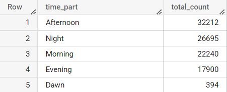
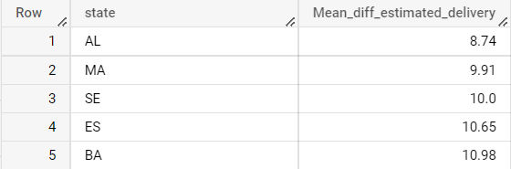

# Analysis of E_Commerce_delivery Database

A database is an organized collection of structured information, or data, typically stored electronically in a computer system. A database is usually controlled by a database management system (DBMS). These data are stored in rows and columns and this data can be retrived by using Structured Query Language (SQL) <br />
This is a `Relational Database` which means that the data that are stored in a rows and columns and the tables are connected to each other with the help of `primary key` and `foreign key` constraints.<br />

**The following diagram shows the stucture of the database** <br />
 . So it was imported to the Sql envirnment and the analysis is done. Since size of the data is very large Google Sandbox Big Query is used since the processing speed is faster. This ananlysis has  analysing of data and providing `Actionable insight` with some `Recomandation`

## Concepts used <br />

To analyze the data I have used `DML` command to retrieve the useful data from the database which include,

* The basic clauses like `SELECT`, `JOIN`, `GROUP BY`, `ORDER BY`

* Analytical functions like `AGGREGATION FUNCTIONS` and `WINDOW FUNCTIONS`


### Analysis

#### 1.Getting  to know about the datatypes of each table

``` sql
select 
    column_name, data_type
from 
    `E_commerce.INFORMATION_SCHEMA.COLUMNS`
where 
    table_name = 'customers'
order by 
    ordinal_position
```
* Customer Table <br />

* Geolocation Table <br />
  
* Order Item Table <br />
 
* Order Table <br />
 
* Payment Table <br />
 
* Order Review Table <br />
 
* Products Table<br />

* Sellers Table <br />
 


#### 2.Time period of the data given <br />
* Query 
``` sql
        SELECT 
            cast(min(order_purchase_timestamp) as date) as start_date,
            cast(max(order_purchase_timestamp) as date) as end_date

        FROM
            `E_commerce.orders`
```
* Output snippet <br />
     <br />
The given table contains the data from 4th September 2016 to 17th October 2018 with almost close to 2 years of data

#### 3.Cities and states covered in the data <br />
* 3a.Cities <br />
**Query** 
```sql 
SELECT 
      distinct geolocation_city as city
FROM
      `E_commerce.geolocation`
```
* Output snippet <br />
<br />
The dataset contains a total of `8011` cities <br />

*3b.States <br />
**Query**
```sql 
SELECT 
      distinct geolocation_state as state 
FROM
      `E_commerce.geolocation`
```
* Output snippet <br />
<br />


#### 4.Exploring the growing trend on e-commerce in the given data and finding if there are seasonality with peaks at specific months.<br />
* Query
``` sql
with cte as 
(SELECT 
      extract(month from order_purchase_timestamp) as month,
       extract(year from order_purchase_timestamp) as year,
      count(order_id) as total_orders
FROM
      `E_commerce.orders`
group by 
    1,2
order by 
    2,1)

select 
  concat(month,"-",year) as time_period,
  total_orders
from 
  cte 
```
* Output snippet <br />
<br />
<br />
From the data we could see that there is a spike in the orders from the year 2017 and a rapid collapse of orders towards the end of the 2018. 
It is evident that there is increase in orders in first quarter of each year. 

#### 5.Part of day at which the customers tend to buy products <br />
* Query
``` sql 
with cte as 
        ((select
            *,
            (case
                  when (extract(time FROM order_purchase_timestamp)) between "04:00:00" and "06:00:00" then "Dawn"
                  when (extract(time FROM order_purchase_timestamp)) between "06:00:01" and "12:00:00" then "Morning"
                  when (extract(time FROM order_purchase_timestamp)) between "12:00:01" and "17:00:00" then "Afternoon"
                  when (extract(time FROM order_purchase_timestamp)) between "17:00:01" and "20:00:00" then "Evening"
                  else "Night"
                  end) as time_part 
        from 
            `E_commerce.orders`))

select 
  time_part,
  count(order_id) as total_count 
from 
  cte
group by 
  1
order by 
  2 desc
```
* Output snippet <br />
<br />
From the result it is evident that people in Brazil tends to buy the products during Afternoon <br />

#### 5.Month on month orders by region, states <br />
* Query <br />
``` sql 
select  
  extract(month from o.order_purchase_timestamp) as month,
  extract(year from o.order_purchase_timestamp) as year,
  c.customer_city as city,
  c.customer_state as state,
  count(o.order_id) as orders_count
from 
  `E_commerce.orders` o  join `E_commerce.customers` c
  on o.customer_id = c.customer_id
group by 
  1,2,3,4
order by 
  2,1
```
* Output snippet <br />


#### 6.Distribution of Customers State wise 
* Query
``` sql 
select 
  customer_state as city,
  count(customer_id) as customers_count
from 
  `E_commerce.customers`
group by 
  1
order by 
  2 desc
```
* Output snippet <br />
 <br />

#### 7.Distribution of Customers City wise
* Query
``` sql
select 
  customer_city as city,
  count(customer_id) as customers_count
from 
  `E_commerce.customers`
group by 
  1
order by 
  2 desc
```
* Output Snippet <br />
 <br />

#### 8.Percentage increase in cost of orders from 2017 to 2018 <br />
NOTE : Since the tables have comman months from January to August, analysis is only made on these month of two years
* Query
``` sql
with data_2017 as (

  select 
    round(sum(oi.price + oi.freight_value),2) as cost
  from
    `E_commerce.order_items` oi join `E_commerce.orders` o 
    on oi.order_id = o.order_id 
  where 
    (extract(month from o.order_purchase_timestamp) in (1,2,3,4,5,6,7,8)) and 
    (extract(year from o.order_purchase_timestamp)  =  2017)
),
data_2018 as (

  select 
    round(sum(oi.price + oi.freight_value),2) as cost
  from
    `E_commerce.order_items` oi join `E_commerce.orders` o 
    on oi.order_id = o.order_id 
  where 
    (extract(month from o.order_purchase_timestamp) in (1,2,3,4,5,6,7,8)) and 
    (extract(year from o.order_purchase_timestamp)  =  2018)
)

select 
  round(((d18.cost - d17.cost) / d17.cost) * 100,2) as percentage_increase_in_cost
from 
  data_2018 d18, data_2017 d17
```
* Output sinppet  <br />
 <br />
From the output it is seen that there is increase of 138% of increse in cost 

#### 9.Analysis of sum of price and freight value and also average price and freight value <br />
* Query
``` sql
select 
  c.customer_state as state,
  round(sum(oi.freight_value),2) as sum_of_freight_value,
  round((sum(oi.freight_value)/count(o.order_id)),2) as mean_freight_value,
  round(sum(oi.price),2) as sum_of_price_value,
  round((sum(oi.price)/count(o.order_id)),2) as mean_price_value
from 
  `E_commerce.customers` c join `E_commerce.orders` o 
  on c.customer_id = o.customer_id
  join `E_commerce.order_items` oi 
  on o.order_id = oi.order_id 
group by 
  1
order by  
  1
```
* Output snippet <br />


#### 10.Analysis of delivery metric <br />
* Time to delivery <br />
* Difference in estimate time to delivery <br />

* Query
``` sql
select
  order_id,
  order_purchase_timestamp,
  order_delivered_customer_date,
  order_estimated_delivery_date,
  date_diff(date (extract(date from order_delivered_customer_date)),date (extract(date from order_purchase_timestamp)),day) as time_to_delivery,
  date_diff(date (extract(date from order_estimated_delivery_date)),date (extract(date from order_delivered_customer_date)),day) as diff_estimated_delivery
from 
  `E_commerce.orders`
```
* Output snippet <br />
 <br />
In some of the diff_estimated_delivery we could see that there is a negative symbol which stated that the delivery was given before the estimated delivery date 

#### 11.Average freight_value, time_to_delivery, diff_estimated_delivery state wise <br />
* Query
``` sql
select
  c.customer_state as  state,
  round(sum(oi.freight_value) / count(o.order_id),2) as Mean_freight_value,
  round(avg(date_diff(date (extract(date from o.order_delivered_customer_date)),date (extract(date from o.order_purchase_timestamp)),day)),2) as Mean_time_to_delivery,
  round(avg(date_diff(date (extract(date from o.order_estimated_delivery_date)),date (extract(date from o.order_delivered_customer_date)),day)),2) as Mean_diff_estimated_delivery
from 
  `E_commerce.customers` c join `E_commerce.orders` o 
   on c.customer_id = o.customer_id
  join `E_commerce.order_items`oi 
  on o.order_id = oi.order_id
group by 
  1
order by 
  1
```
* Output Snippet <br /> 


### TOP 5 and BOTTOM 5 Analysis <br />

#### 13.Top 5 states with highest/lowest average freight value <br />

* 13a. Top 5 states with highest average freight value<br />
* Query 
``` sql
select
  c.customer_state as  state,
  round(sum(oi.freight_value) / count(o.order_id),2) as Mean_freight_value
from 
  `E_commerce.customers` c join `E_commerce.orders` o 
   on c.customer_id = o.customer_id
  join `E_commerce.order_items`oi 
  on o.order_id = oi.order_id
group by 
  1
order by 
  2 desc
limit 
  5
```
* Output snippet <br />


* 13b. Bottom 5 states with highest average freight value <br />
* Query
``` sql
select
  c.customer_state as  state,
  round(sum(oi.freight_value) / count(o.order_id),2) as Mean_freight_value
from 
  `E_commerce.customers` c join `E_commerce.orders` o 
   on c.customer_id = o.customer_id
  join `E_commerce.order_items`oi 
  on o.order_id = oi.order_id
group by 
  1
order by 
  2 asc
limit   5
```
* Output Snippet <br />


#### 14. Top 5 states with highest/lowest average time to delivery <br />
* 14a. Top 5 states with highest average time delivery <br />
* Query 
``` sql 
select
  c.customer_state as  state,
    round(avg(date_diff(date (extract(date from o.order_delivered_customer_date)),date (extract(date from o.order_purchase_timestamp)),day)),2) as Mean_time_to_delivery
from 
  `E_commerce.customers` c join `E_commerce.orders` o 
   on c.customer_id = o.customer_id
  join `E_commerce.order_items`oi 
  on o.order_id = oi.order_id
group by 
  1
order by 
  2 desc
limit 
  5
```
* Output snippet <br />
 <br />

* 14b. Bottom 5 states with highest average time delivery <br />
* Query 
``` sql
select
  c.customer_state as  state,
    round(avg(date_diff(date (extract(date from o.order_delivered_customer_date)),date (extract(date from o.order_purchase_timestamp)),day)),2) as Mean_time_to_delivery
from 
  `E_commerce.customers` c join `E_commerce.orders` o 
   on c.customer_id = o.customer_id
  join `E_commerce.order_items`oi 
  on o.order_id = oi.order_id
group by 
  1
order by 
  2 asc
limit 
  5
```
* Output snippet<br />
 <br />

#### 15.Top 5 states where delivery is really fast/ not so fast compared to estimated date <br />
* 15a. Top 5 states where the delivery is fast compared to estimated date <br />
* Query 
``` sql
select
  c.customer_state as  state,
  round(avg(date_diff(date (extract(date from o.order_estimated_delivery_date)),date (extract(date from o.order_delivered_customer_date)),day)),2) as Mean_diff_estimated_delivery
from 
  `E_commerce.customers` c join `E_commerce.orders` o 
   on c.customer_id = o.customer_id
  join `E_commerce.order_items`oi 
  on o.order_id = oi.order_id
group by 
  1
order by 
  2 asc 
limit 
	5
```
* Output Snippet <br />
 <br />

* 15b. Top 5 states where the delivery is not fast compared to estimated date <br />
* Query
``` sql
select
  c.customer_state as  state,
  round(avg(date_diff(date (extract(date from o.order_estimated_delivery_date)),date (extract(date from o.order_delivered_customer_date)),day)),2) as Mean_diff_estimated_delivery
from 
  `E_commerce.customers` c join `E_commerce.orders` o 
   on c.customer_id = o.customer_id
  join `E_commerce.order_items`oi 
  on o.order_id = oi.order_id
group by 
  1
order by 
  2 desc  
limit 
  5
```
* Output snippet <br />
<br />

#### 16.Month on Month count of orders for different payment types <br />
* Query
```sql
select 
  extract(month from o.order_purchase_timestamp) as month,
  extract(year from o.order_purchase_timestamp) as year,
  p.payment_type as payment_mode,
  count(p.order_id) as count_of_orders
from 
  `E_commerce.payments` p  join `E_commerce.orders`o 
  on o.order_id = p.order_id
group by 
  3,1,2
order by 
  2,1,3
```
* Output snippet <br />
 <br />

#### 17.Distribution of payment instalments and count of orders <br />
* Query
``` sql
with payment_distribution as (
  select 
    order_id,
    (case 
         when payment_installments = 0 then "0(not_opted_for_emi)"
         when payment_installments between 1 and 6 then "1-6"
         when payment_installments between 7 and 12 then "7-12"
         when payment_installments between 13 and 18 then "13-18"
         when payment_installments between 19 and 24 then"19-24" 
    end ) as installment_month
  from 
    `E_commerce.payments`
)

select
 installment_month ,
 count(order_id) as count_of_orders
from 
  payment_distribution
group by 
  1
```
* Output Snippet <br />


### Actionable Insight 

1. We could see that there is a dip in orders in the Q2 and Q3 in orders as per the data given 
2. It is observed that the customers tend to buy more products during the Afternoon time period and least during dawn 
3. We can see that customers’ orders are high in the highly populated and famous cities 
4. Increase in cost is highly corelated with increase in orders 
5. There is difference in average freight values between each state, 42.98 being highest and 15.15 being lowest 
6. There is difference in delivery time with in each state of the data provided 
7. 99% of the customers tend to choose for Emi during purchase of the product

### Recomendation 
1. It is recommended to improve the sales during low performing quarters of the year by provided offers and sales 
2. It is recommended to improve the delivery time period in states where the delivery time it least 
3. Marketing and promotions to be made in the cities and states where the customer count is least 
4. Avg difference of estimated vs delivered date ranges from 8-20 days. The variance can be improved
5. Almost 2/3rd of the customers is coming from 3 states. Target can focus on other states to attract